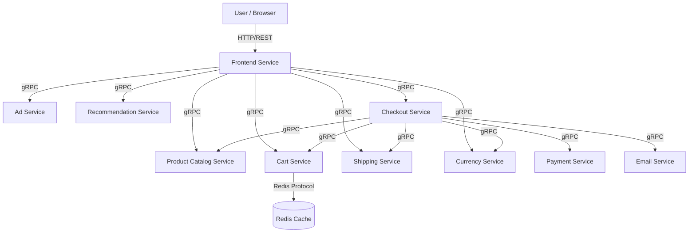

# Online Shop Demo (Online Boutique) Design Document

## 1. System Overview

**Online Boutique** is a cloud-native microservices application used to demonstrate Google Cloud technologies. It represents an e-commerce platform where users can browse items, add them to a cart, and purchase them.

The application is composed of **11 microservices** written in multiple languages (Go, C#, Node.js, Python, Java) that communicate via gRPC.

### Current Deployment Status
The application is currently deployed across two Google Kubernetes Engine (GKE) clusters in the `mslarkin-ext` project, ensuring high availability and demonstrating different GKE modes (Standard vs. Autopilot).

| Cluster Name | Location | Type | Status |
| :--- | :--- | :--- | :--- |
| `prod-autopilot-cluster-1` | `us-west1` | Autopilot | **Running** (All 11 services + Redis) |
| `prod-standard-cluster-1` | `us-central1` | Standard | **Running** (All 11 services + Redis) |

## 2. Architecture

The architecture follows a microservices pattern where a public-facing Frontend service communicates with backend services over gRPC. State is stored in Redis (for the cart) and in-memory/mock databases for other services to keep the demo self-contained.

### High-Level Topology

## 3. Component Details

The following table details the components currently running in both the `prod-autopilot-cluster-1` and `prod-standard-cluster-1` clusters.

| Service Name | Language | Type | Description |
| :--- | :--- | :--- | :--- |
| **frontend** | Go | Web Server | Exposes an HTTP server (port 80) to serve the website. Handling user sessions and request routing. Exposed via LoadBalancer. |
| **cartservice** | C# | Backend | Stores user shopping carts. Persists data to the `redis-cart` component. |
| **productcatalogservice** | Go | Backend | Provides product listings and search capabilities. Reads from a static JSON product list. |
| **currencyservice** | Node.js | Helper | Converts money amounts between currencies. Uses real exchange rates. |
| **paymentservice** | Node.js | Backend | Processes mock credit card transactions. |
| **shippingservice** | Go | Backend | Provides shipping cost estimates and tracks shipments (mock). |
| **emailservice** | Python | Backend | Sends order confirmation emails (mock). |
| **checkoutservice** | Go | Orchestrator | Handles the checkout process by coordinating payment, shipping, email, and cart services. |
| **recommendationservice** | Python | Backend | Recommends products based on cart contents. |
| **adservice** | Java | Backend | serves context-aware text ads. |
| **loadgenerator** | Python/Locust | Utility | continuously sends requests to the frontend to simulate user traffic for metrics. |
| **redis-cart** | Redis | Database | Redis instance used solely by `cartservice` for state persistence. |

## 4. Workload Configuration

Both clusters utilize the default namespace and standard Kubernetes objects:
- **Deployments**: Manage the lifecycle of pods for each service.
- **Services**: Provide stable networking.
    - `frontend-external`: Type `LoadBalancer`, providing the public IP.
    - Others: Type `ClusterIP` for internal gRPC communication.

### Observed Infrastructure
- **`prod-autopilot-cluster-1`** (us-west1): GKE Autopilot manages node provisioning and scaling automatically.
- **`prod-standard-cluster-1`** (us-central1): Standard GKE cluster with explicit node pool management (e.g., `a2-highgpu` nodes observed, though likely not used by this CPU-bound demo).

## 5. Network Flow
1.  **Ingress**: Traffic enters via the External Load Balancer mapped to the `frontend-external` service.
2.  **Internal**: The frontend service handles the HTTP request and fans out gRPC calls to backend services (e.g., `productcatalogservice` for items, `cartservice` for user state).
3.  **Checkout**: When a purchase is made, `frontend` calls `checkoutservice`, which orchestrates the transaction across `paymentservice`, `shippingservice`, `emailservice`, etc.

This design ensures defined boundaries, allowing independent scaling and development of each microservice.
